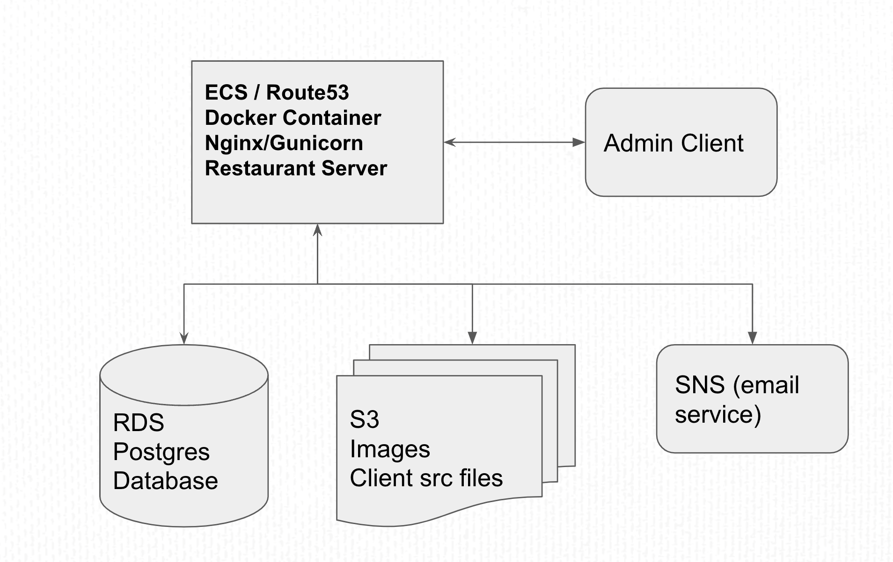
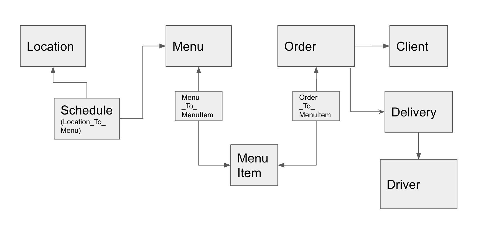
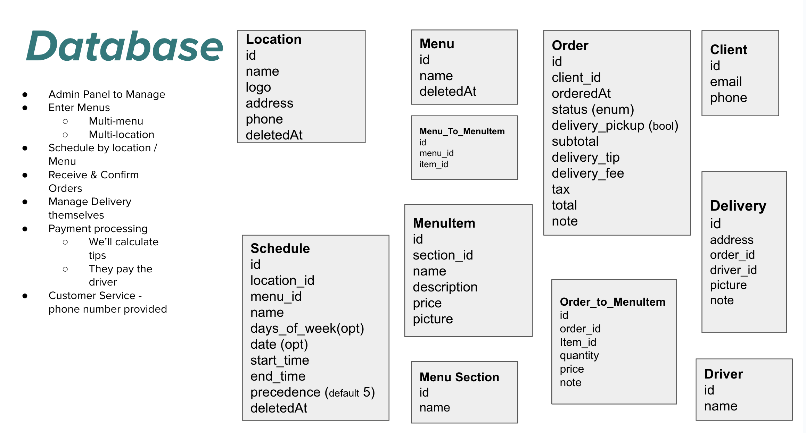

# Technical Design Document (TDD)

## 1. Supp
orting Documents

[PRD](./prd.md)

## 2. System Architecture

[Describe the high-level architecture of the system, including any key components, modules, or layers.]

* Django project with Django-rest-framework (EC2 / ECS)
* Postgres Database (RDS)
* Image store (S3)
* Hosted Admin Client with React (S3)
* Docker deployed with nginx / gunicorn

## 4. Data Model

[Present the data model for the system, including entities, relationships, and attributes.]

## 6. Database Design

[Describe the design of the system's database, including tables, indexes, and any specific data storage considerations.]

## 5. API Specifications
[Define the specifications for the system's APIs, including endpoints, request/response formats, and supported methods.]

* Location
  * Read - End User
  * Create, Update, Delete - Admin User
  * Filter by distance from end user (out of scope for v0)
* Menu
  * Read - End User
  * Create, Update, Delete - Admin User
  * Filter by Active - End User
* Section
  * Read - End User (as part of menu)
  * Create, Update, Delete - Admin User
* Schedule
  * Read - End User (as part of menu)
  * Create, Update, Delete - Admin User
* Order
  * Create, Update, Delete - End User
  * Read / potentially limited update - Admin
* Client
  * Create, Read, Update, Delete - (Me) End User
  * Create, Read, Update, Delete - All, Admin
* Delivery
  * Create, Read, Update - User / by permission
* Driver
  * Create, Read, Update, Delete - Me, Driver
  * Create, Read, Update, Delete - Admin

## 7. Deployment

[Explain the deployment strategy for the system, including infrastructure requirements, hosting platforms, and deployment processes.]

* AWS EC2 for server
* AWS S3 for client
* Github Actions on push to main
* ECS for docker imaging / scaling

## 8. Security

[Outline the security measures and considerations for the system, including authentication, authorization, and data protection mechanisms.]

* Dedicated IAM roles for deployments / users
* Restrict development url to specified IP addresses

## 9. Performance

[Discuss performance considerations for the system, including potential bottlenecks, scalability, and optimization techniques.]

* Cost is more important 
* We're working on AWS Free tier only

## 10. Error Handling

[Describe how errors and exceptions will be handled within the system, including any agreed on error codes, logging, and error recovery strategies.]
* Logs on the box

## 11. Testing Strategy

[Explain the testing approach for the system, including unit testing, integration testing, and any specific testing tools or frameworks to be used.]
* Unittests to be run in-line with CI on Github Actions

## 13. Dependencies

[List any external dependencies or third-party libraries that are required for the system.]
* Django
* 

## 14. Risks and Mitigation Strategies

[Identify potential risks or challenges that may impact the development or operation of the system, and provide mitigation strategies for each.]

## 15. Open Questions

[List any questions you may have that will need to be answered either before, or during the project]

## 15. Appendix

[Include any additional supporting documents, diagrams, or references as needed.]

